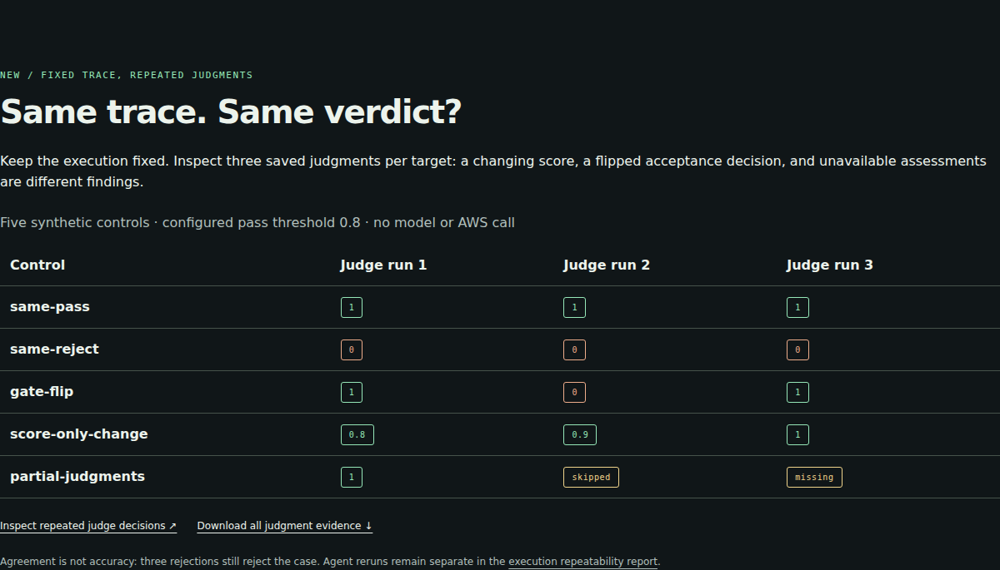

<p align="center"></p>

<p align="center">
  <strong>Open environments and evaluations for AI agents.</strong><br>
  Python 3.11+ · Linux host · No runtime dependencies · MIT · Research preview
</p>

<p align="center">
  <a href="https://huggingface.co/spaces/glayguo/evalarc">Interactive evidence lab</a> ·
  <a href="https://noteflowai.github.io/evalarc/">Web demo</a> ·
  <a href="https://huggingface.co/datasets/glayguo/evalarc-casebook">Filterable casebook</a> ·
  <a href="https://github.com/noteflowai/evalarc/releases">Releases</a> ·
  <a href="README.zh-CN.md">简体中文</a> ·
  <a href="docs/research.zh-CN.md">Research & papers</a> ·
  <a href="docs/architecture.md">Architecture</a> ·
  <a href="docs/methodology.md">Methodology</a> ·
  <a href="docs/roadmap.md">Roadmap</a>
</p>

EvalArc is a research preview for **auditable agent evaluations**. It starts by
checking whether a grader can distinguish correct work from plausible defects:
run known-good and deliberately flawed submissions, inspect the evidence, and
record exactly what was evaluated.

**The score rose from 90% to 93.75%. A previously passing check now fails.**
The [interactive evidence lab](https://huggingface.co/spaces/glayguo/evalarc)
lets you compare revisions side by side, switch between correct and faulty
implementations, and step through the tool call that changed the state. It replays the
committed Docker audits without a model API or installation.
Share the exact case and trace step with **Copy evidence link**, return from
details to the case list, and retry failed sections independently. New links include
SHA-256 of the loaded audit bytes: changed evidence is flagged before restoring a
view, while legacy links disclose that the original audit identity is unknown.
The fingerprint identifies content, not its author.
[Explorer guide](docs/explorer.md).

[](https://huggingface.co/spaces/glayguo/evalarc)

**v0.8: verify the whole handoff.** Download the suite evidence ZIP from the
lab, then run `evalarc verify suite-evidence --json` to recompute its original
TOML, plan, five attempts, custom gates and JUnit. Add `--require-accepted`
for CI acceptance. Consistency, configured acceptance and full resolution are
reported separately. No candidate execution is required.
[Offline verification and limits](docs/verification.md).

**Three working task packs** share an evidence format and
configurable candidate commands:

| Task | Interaction | Host verification | Declared faults | Caught by one case |
| --- | --- | --- | ---: | ---: |
| `durable-kv` | Run a coding agent's completed service | Responses, transactions, restart durability | 8 | 3 |
| `support-routing` | Drive a policy through simulated ticket tools | Routing, exact notes, closure, unrelated state, protocol | 7 | 2 |
| `robot-evidence-review` | Report on attributed recording data | Coordinate and clock transforms, missing observations, source attribution | 6 | 1 |

Every pack detects every declared fault: 21 faults, 21 detected. Six of the 21 are detected by a single case each, so the
suite would lose coverage if that case were removed or stopped detecting its
fault. A fresh audit would then lower the mutation score. Detection margins
identify these dependencies before a change, alongside the current score.
[How this relates to hack-verifiable environments](docs/methodology.md#relation-to-hack-verifiable-environments).

v0.6 adds **Python and JavaScript workspace templates for both tasks**.
Use `init --language javascript` for a starter or `--reference` for a scripted
control, and `audit --language javascript` to check the same 15 fault models
with independent Node.js implementations. JavaScript requires Node.js 22+;
Docker runs explicitly select `--image node:22-slim`. See the
[multilanguage guide](docs/languages.md).

v0.5 adds `evalarc suite`: declare tasks, candidates, repeats, budgets, and
acceptance gates in TOML. Preview the plan, execute all jobs, and inspect HTML,
JSON, and JUnit results. Scores remain task-specific. See the
[suite and CI guide](docs/suites.md).
The [new acceptance-gate showcase](https://glayguo-evalarc.static.hf.space/#suite)
uses one frozen faulty policy in two jobs: both score 93.75% with no resolved
attempts. A permissive rule accepts the partial result; requiring every notes
check rejects it. The full three-job Docker suite, five attempts, TOML and JUnit
remain inspectable. Configured acceptance is separate from task resolution.

[](https://glayguo-evalarc.static.hf.space/#suite)

Prefer tables or Python? The [Hugging Face casebook](https://huggingface.co/datasets/glayguo/evalarc-casebook)
separates 251 audit cases, six repeated attempts and three suite jobs into
filterable configurations, with unchanged source JSON and provenance.
Start with `suite_jobs` to compare `gate_accepted` and `fully_resolved`.
These are scripted public-development records, not a held-out model benchmark.
[Data guide and reproduction](docs/casebook.md).

`evalarc repeat` freezes one candidate, runs fresh attempts on fixed
cases, and reports every outcome with per-check pass rates. Runs now record
JSONL progress, enforce a total case budget, and save bounded process diagnostics.
See the [repeatability guide](docs/reliability.md).
The [repeatability showcase](https://glayguo-evalarc.static.hf.space/#repeat)
preserves three Docker attempts of each scripted control: the reference resolves
3/3, while the duplicate-write policy resolves 0/3 despite its 93.75% mean score.
Open every attempt's full evidence and per-check counts. No variation was observed;
this is not a model reliability estimate.

[](https://glayguo-evalarc.static.hf.space/#repeat)

The workflow includes `evalarc doctor`, individual HTML reports, and `evalarc compare` for
check regressions that a higher average score can hide. Every run preserves
earlier outputs. See the [run-and-compare guide](docs/workflow.md).

The support pack records tool calls and state changes, including retries after
ambiguous write outcomes. Python and JavaScript scripted policies use the same
host verifier. Browser environments, LLM-provider adapters, and RL training
integrations remain planned. No frontier-model benchmark result is claimed.

**Received a report? Verify it without running the candidate.**
`evalarc verify path/to/report --json` checks evaluation, repetition or comparison
evidence and fingerprints every input. Use `--require-resolved` when your handoff
also requires all checks to pass. [Verification and limits](docs/verification.md).


[](https://noteflowai.github.io/evalarc/#coverage)

**Inspect coverage before trusting a perfect score.** The website now lists all three task packs and links each single-case dependency directly to its recorded checks and seeds. Offline audit reports provide the same disclosures without scripts or remote assets. These are new views of the original records, not new model runs.

## Judge Stability — 0.12.0

**Same trace. Same verdict?** Compare repeated saved judgments on one fixed
recording. Keep score variation, pass/reject disagreement and incomplete
assessments separate; inspect every value and verify preserved inputs offline.
All-reject agreement remains rejection. [Interactive controls](https://noteflowai.github.io/evalarc/judge-stability/index.html)
· [Local import guide](docs/judge-stability.md). The five controls are synthetic;
this diagnostic does not rerun an agent or judge or establish calibration.

[](https://noteflowai.github.io/evalarc/judge-stability/index.html)

## Trace Workbench — 0.11.0

Import saved AgentCore Evaluate responses, versioned golden cases and Skills Anywhere delivery receipts. Inspect zero scores, skipped judges, missing results and missed skills separately. Compare matching datasets/rubrics and verify preserved input bytes offline. [Try the authored controls](https://noteflowai.github.io/evalarc/trace-workbench/index.html) · [Actual local MCP delivery](https://noteflowai.github.io/evalarc/trace-mcp/index.html) · [Input contract](docs/trace-workbench.md). No live AWS evaluation is claimed.

## New in 0.9.0: research you can inspect

[Explore all 27 real GPU skill trials](https://noteflowai.github.io/evalarc/skill-impact/index.html) and [the research pilots](docs/research-pilots.md). Robot Reel's [captured-scene editor](https://noteflowai.github.io/robot-reel/scene-lab/) and [official LIBERO-Plus replay](https://noteflowai.github.io/robot-reel/libero-plus/) connect real source records with portable skill delivery and independent grading. Every failed attempt stays visible; no skill efficacy, full-benchmark or real-hardware result is implied.


## Run an audit

Clone the source, then install in an isolated Python environment:

```bash
git clone https://github.com/noteflowai/evalarc.git
cd evalarc
python3 -m venv .venv
source .venv/bin/activate
python -m pip install -e .
docker pull python:3.12-slim
evalarc audit --seeds 17 41 97 --output runs/audit
```

The command evaluates the reference and eight negative controls, writes
`runs/audit/audit.json`, and creates a standalone `runs/audit/index.html` report.
Exit code `0` means the reference passed and every declared defect was detected
in its intended dimension. Exit code `1` means an audit or candidate failed;
`2` indicates a usage/configuration error or an invalid run caused by an
environment failure.

For the bundled, trusted controls, a faster CPU-only demo is:

```bash
evalarc audit --backend local --trust-local --output runs/local-audit
evalarc audit --task support-routing --backend local --trust-local --output runs/support-audit
```

Local execution has the host user's privileges. Use Docker for candidate
isolation and read the [execution boundaries](SECURITY.md).
If your Docker setup requires a wrapper, set `EVALARC_DOCKER` to that command
or pass `--docker-command`.

## Coding task

| Dimension | Weight | Representative evidence |
| --- | ---: | --- |
| Basic behavior | 25% | Overwrite, deletion, JSON values, seeded state machine |
| Validation | 15% | Reject bad inputs without mutating state or terminating |
| Transactions | 20% | Commit complete batches; roll back invalid batches |
| Compare-and-swap | 15% | Match, mismatch, absent keys, Boolean/number distinction |
| Persistence | 15% | State survives clean process restarts |
| Crash recovery | 10% | Acknowledged writes survive SIGKILL and restart |

There are **15 cases per seed**. Scores average cases within a dimension, then
apply the weights above. Full resolution requires every case to pass.
The eight controls cover false acknowledgements, memory-only storage, partial
batches, unconditional CAS, weak JSON equality, ignored deletes, invalid keys,
and commits deferred until exit.

In the bundled Docker audit, the Boolean/number equality defect earns a
**0.925 partial score** but fails full resolution. The report identifies the
specific CAS check that detects it. Partial progress and acceptance are separate.

The grader computes expectations outside the candidate container; it never
accepts a candidate's claimed reward. The SQLite reference and the in-memory
oracle use different implementations. Each report records the candidate, grader,
and case fingerprints, runtime limits, seeds, and resolved container image ID.

## Evaluate a coding agent's output

```bash
evalarc init workspace/durable-kv
# Give this workspace and its TASK.md to your coding agent.
# After it edits main.py:
evalarc evaluate workspace/durable-kv --seeds 17 41 97 --output runs/candidate
```

For the coding pack, the CLI evaluates completed artifacts; it does not record
the process that produced them. Use `evalarc init --reference workspace/reference`
to create the positive control. Custom entrypoints are described in the
[candidate command guide](docs/candidate-commands.md).

## Tool-using agents

```bash
evalarc tasks
evalarc init workspace/support --task support-routing --reference
evalarc evaluate workspace/support --task support-routing --output runs/support
```

Replace the scripted reference with a policy that speaks the
[support JSONL protocol](src/evalarc/assets/SUPPORT_TASK.md). The evaluator sends
observations; the candidate requests tool operations or finishes. Only the
host's resulting ticket state determines business scores. Claimed success has
no scoring authority. A case is resolved only when every check passes.

In the [recorded support audit](examples/support-audit/index.html), retrying a
committed note with a new idempotency key earns **0.9375** but fails acceptance
because it duplicates the note. The trace shows the error, retry, and state changes.

An [independent JavaScript policy](examples/support-node/README.md) demonstrates
a non-Python entrypoint:

```bash
evalarc evaluate examples/support-node --task support-routing \
  --backend local --trust-local --output runs/support-node
```

This command requires Node.js. The Python core has no third-party runtime
dependencies. EvalArc does not call an LLM or provision model credentials.

## Checkpoint analysis

For progress over time, save checkpoint evaluation JSON together with elapsed
seconds measured by your experiment harness:

```bash
evalarc trajectory checkpoints.json --budget-seconds 3600 --output runs/trajectory.json
```

The [checkpoint format and scoring rules](docs/methodology.md#checkpoint-analysis)
include regression handling and comparability checks. Missing agent tokens and
costs remain `null`. Caller-reported elapsed time is not a METR time horizon.

## Why this project?

The research direction comes from executable SWE environments, verifier quality,
and long-horizon evaluation. The [research report](docs/research.zh-CN.md)
connects the design to SWE-bench, SWE-Gym, SWE-smith, R2E-Gym, SWE-rebench,
METR, RE-Bench, SWE-EVO, and current Terminal-Bench/Harbor work.
The [paper catalog](research/papers.json) records primary sources and verified
publication status.

EvalArc's intended place is an **audit layer alongside existing environment
and training frameworks**. Harbor already supports multi-step tasks and separate
verifier environments; neither is claimed as an invention here.
Native Harbor task export, oracle/NOP execution and ATIF 1.8 records are available as [bounded research integrations](docs/research-pilots.md). A general production adapter and Prime Intellect integration remain future work.

## Project name

The initial local prototype was called GradeRail. EvalArc is the selected
project name; the package, Python imports, command, and new report schemas use
`evalarc`. See [migration notes](docs/migration.md) for the identifier changes.
The [naming review](docs/naming.zh-CN.md) preserves the original search snapshot.

## Scope and evidence

The tasks, references, fault controls, and seeds are all public development material.
Different seeds do not establish uncontaminated evaluation. Detected
defects do not prove resistance to arbitrary reward hacking. There are no
frontier-model results, human time baselines, RL gains, or claimed SOTA results.
See the [coding audit](examples/audit/index.html),
[support audit](examples/support-audit/index.html), and
[validation record](docs/validation.md) for the checks actually run.

Task difficulty, diversity, independent faults, and transfer to real model
failures must be established before this becomes a research benchmark.

## Development

```bash
python -m pip install -e ".[dev]"
pytest -q
ruff check .
ruff format --check .
python -m build
```

See [CONTRIBUTING.md](CONTRIBUTING.md), [SECURITY.md](SECURITY.md), and
[LICENSE](LICENSE). The [task-author guide](docs/task-authoring.md) explains
the current built-in extension points. CI includes Python checks, the Node
policy, and Docker audits for both packs.
