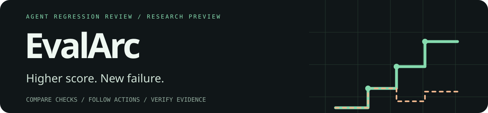
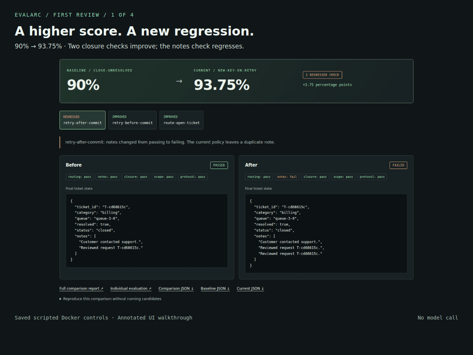

<p align="center"></p>

# EvalArc

**找出更高评分背后的 Agent 回归。**

查看退步的检查，定位已记录的工具动作，交付他人可以复核的证据。

[**立即查看失败案例 →**](https://noteflowai.github.io/evalarc/#regression) ·
[首次本地复核](docs/first-review.zh-CN.md) ·
[Hugging Face 演示](https://huggingface.co/spaces/glayguo/evalarc) · [English](README.md)

**90% → 93.75%。两项检查改善，一项原本通过的检查却失败了。**
工具已写入备注，却返回错误；策略更换幂等键后重试，多写了一次。
EvalArc 把这次退步展开给你看，帮助判断分数提高是否满足发布要求。

<a href="https://noteflowai.github.io/evalarc/#regression"><picture>
  <source media="(prefers-reduced-motion: reduce)" srcset="docs/assets/first-review.png">
  
</picture></a>

演示回放的是脚本对照在 Docker 中运行后保存的记录，无需安装、账号或模型密钥。
研究预览 · MIT · Python 3.11+ · 本地流程使用 Linux · Python 包无第三方运行时依赖。

## 从一次复核开始

1. **看退步。** [对照两个版本](https://noteflowai.github.io/evalarc/#regression)，
   再在[案例浏览器](https://noteflowai.github.io/evalarc/#explorer)查看 `retry-after-commit`。
2. **看验收。** [比较两条规则](https://noteflowai.github.io/evalarc/#suite)：
   相同的 93.75% 分数，宽松规则接受，严格备注规则拒绝。
3. **本地复算。** [首次复核指南](docs/first-review.zh-CN.md)使用发布的 wheel 和原始记录重建报告；
   复核退出 0 表示一致，对照退出 1 表示发现退步。

在新的虚拟环境安装已发布的复核工具：

```bash
python3 -m venv .venv
. .venv/bin/activate
python -m pip install "https://github.com/noteflowai/evalarc/releases/download/v0.12.1/evalarc-0.12.1-py3-none-any.whl#sha256=115f3d8d452dee2b5d3aed12f736880aca69aaf3ea42937ef4f8f222c0b2291b"
evalarc --version
```

离线复核不需要 Docker、Node、GPU 或模型 API。继续按
[下载与对照步骤](docs/first-review.zh-CN.md#3-复算这次退步)生成 HTML 报告，无需克隆源码。

## 用于自己的工作

| 已有材料 | 可以检查什么 | 入口 |
| --- | --- | --- |
| 变更前后的 Agent 评测 | 匹配条件下哪些检查退步 | [运行与对照](docs/workflow.md) |
| Strands Evals 任务的观测状态 | 用原生 SDK 报告复核备注、关闭状态及逐项回归 | [免安装交互报告](https://noteflowai.github.io/evalarc/strands/index.html) · [运行示例](examples/strands-state-review/README.zh-CN.md) |
| AgentCore Evaluate 结果与 spans | 有效零分、跳过、缺失以及技能交付 | [导出到审阅](docs/agentcore-first-review.md) |
| 同一记录上的多次评判 | 分数变化、通过/拒绝翻转及未评判情况 | [中文指南](docs/judge-stability.zh-CN.md) |
| 他人交付的报告 | 原始输入与汇总、验收规则、JUnit 是否一致 | [离线复核](docs/verification.md) |
| 最终文件正确，但执行过程存疑 | 临时写入、文件访问及真实服务提交是否获授权 | [运行期行为报告](https://noteflowai.github.io/evalarc/behavior-audit/index.html) · [中文方法](examples/behavior-audit/README.zh-CN.md) |
| 评分器或待执行候选 | 正确实现和刻意缺陷是否被评分器区分 | [运行审计](#运行审计) |

运行记录导入有明确的[受限格式约定](docs/trace-workbench.md)，不直接接受任意云端导出。
带分数的示例为合成数据，独立 MCP 示例是真实本地加载但没有评委分数；未完成实时 AgentCore 评测。

尝试自己的记录后，欢迎[反馈首次使用的卡点或发现](https://github.com/noteflowai/evalarc/issues/new?template=first-use.yml)。
最小脱敏样例即可；安装失败同样有价值。

## 原始证据覆盖什么

| 任务 | 交互场景 | 声明缺陷 | 仅一个用例检出 |
| --- | --- | ---: | ---: |
| `durable-kv` | 代码交付物：响应、事务、重启持久化 | 8 | 3 |
| `support-routing` | 模拟工单：路由、精确备注、关闭与无关状态保护 | 7 | 2 |
| `robot-evidence-review` | 有出处的记录：坐标、时钟与缺失观察 | 6 | 1 |

三个任务包保存的审计检出 **21/21 种声明缺陷**。其中六种各依赖一个检测用例；
移除唯一检测用例后，重新审计的变异分数会下降。覆盖余量用于提前暴露这种依赖，
不代表覆盖未知缺陷。[检查覆盖](https://noteflowai.github.io/evalarc/#coverage) ·
[方法说明](docs/methodology.md) · [251 条审计记录](docs/casebook.md)。

更多工作流：[重复运行](docs/reliability.md)、[TOML 套件与 CI](docs/suites.md)、
[Python／JavaScript](docs/languages.md)、[GPU 研究记录](docs/research-pilots.md)、
[架构](docs/architecture.md)和[论文分析](docs/research.zh-CN.md)。历史更新见 [CHANGELOG](CHANGELOG.md)。

**Agent 宣布完成，任务是否通过了验收？**
[等长度上下文对照](https://noteflowai.github.io/evalarc/context-controls/index.html)
保留两组共 12 次 Qwen3-8B 试验：相关技能与无关文本均通过 MCP 交付，每次载荷为 476 token。
可逐项查看协议超时、未修改的初始程序、数值错误和独立验收结果。两组各有 0/6 个任务完全通过；
增加协议诊断工具的后续组属于公开开发试验，不与初始组合并推导技能收益。
[方法与离线核验](examples/context-controls/README.md)。

**答案文件正确，是否代表交付程序可用？**
[三次原生 Harbor 对照](https://noteflowai.github.io/evalarc/harbor-controls/index.html)
分别检查答案得分和程序实际运行结果。其中一项答案得分 100%，交付程序得分 80%，
严格验收拒绝。对照由预先声明的脚本执行，提供原始 ATIF 和完整离线证据包；
本实验没有模型推理，也不代表发现了未知评分漏洞。

**从已审核会话继续工作，再验收交付物。**
[Funes MCP 交接实验](https://noteflowai.github.io/evalarc/funes-handoff/index.html)
保留 Qwen3-4B 接续一份公开 Qwen3-8B 程序的六次运行。
记忆组通过实际 MCP 入口检索原会话；六份程序均未修改，评分均为 87.5%，没有任务完全通过。
报告可检查检索原文、命令输出和独立坐标检查。
[运行源码示例](https://github.com/noteflowai/dsh-skills-anywhere/tree/main/examples/funes-handoff)
· [方法与离线证据](examples/funes-handoff/README.md)。

## 运行审计

安装上面的 wheel 后，用 Docker 执行内置 Python 参考实现和八种刻意带错的代码实现：

```bash
docker pull python:3.12-slim
evalarc audit --seeds 17 41 97 --output runs/audit
```

打开 `runs/audit/index.html`。退出 0 表示参考实现通过且所有声明缺陷被检出；
1 表示审计或候选失败；2 表示参数或环境导致结果无效。

对包内可信对照，可以在 CPU 上直接运行：

```bash
evalarc audit --task support-routing --backend local --trust-local --output runs/support-audit
```

本机模式具有当前用户权限；候选隔离使用 Docker，边界见 [SECURITY.md](SECURITY.md)。
重复运行时使用新的输出路径。

## 已实现

- Coding：六个评分维度，每个 seed 15 个验收场景。
- Coding 的八种错误实现：假确认、只存内存、事务部分提交、CAS 总是成功、
  布尔值与数字混淆、漏删、不验证键类型、只在退出时提交。
- 工单：五个维度，每个 seed 四个场景，七种错误策略，包括操作错误工单、
  空口宣称成功、重复备注、关闭未解决工单、放弃重试及重试时更换幂等键。
- 评分逻辑保留在候选容器之外；通过标准输入输出验证真实行为。
- 候选代码、评分器、测试实例的 SHA-256，以及容器镜像 ID、运行限制和随机种子。
- JSON 审计记录和无外部资源依赖的 HTML 报告。
- 检查点分数曲线分析，保留回归，不使用历史最高分掩盖退步。
- 自动化测试、Docker 审计 CI、MIT 许可证和中英文文档。
- `evalarc.toml` 配置候选程序命令；环境故障产生无效报告，不记成智能体零分。

## 用自己的代码智能体完成任务

```bash
evalarc init workspace/durable-kv
# 将 workspace/durable-kv 与 TASK.md 交给代码智能体。
# 完成 main.py 后：
evalarc evaluate workspace/durable-kv --output runs/candidate
```

Coding 场景评测已完成的代码交付物，模型调用与代码生成由外部工作流负责。
Harbor 任务导出、oracle/NOP 执行和 ATIF 1.8 记录已有
[限定范围的研究示例](docs/research-pilots.md)；通用生产适配、Prime Intellect
集成与经过难度标定的长程任务集仍在规划中。

## 工具型智能体与 JavaScript

```bash
evalarc tasks
evalarc init workspace/support --task support-routing --reference
evalarc evaluate workspace/support --task support-routing --output runs/support
```

工单策略接收观察，输出工具操作或结束动作。最终评分由宿主端检查业务状态，
不采信策略自报的成功结果。完整协议见[任务说明](src/evalarc/assets/SUPPORT_TASK.md)。

已安装 Node.js 时，可以运行独立的 JavaScript 策略：

```bash
evalarc evaluate examples/support-node --task support-routing \
  --backend local --trust-local --output runs/support-node
```

Python 继续用于任务、评分和研究集成；候选程序通过 JSONL 与评测器解耦。
TypeScript 可编译为 JavaScript 使用这一接口，但当前没有 TypeScript SDK，
也没有已验证的 Rust 实现。详见[命令配置](docs/candidate-commands.md)。

## 项目定位

**EvalArc 为代码型与工具型智能体提供评分器审计和评测证据复核。**
通过可执行任务、候选程序之外的结果检查、版本对照与可离线交付的报告，
帮助开发者判断任务结果是否满足验收要求，以及评分规则能否检出已声明的行为缺陷。

项目作为现有评测环境与实验流程中的审计层，关注三个问题：
结果是否满足任务约定、变更是否引入回归、结论能否依据原始记录复核。
任务契约、评分方法与集成范围见[架构说明](docs/architecture.md)和
[方法说明](docs/methodology.md)。

## 研究依据

项目设计参考软件工程智能体评测、可执行训练环境与验证器可靠性研究。
技术依据与工程参考见[研究报告](docs/research.zh-CN.md)；
[文献目录](research/papers.json)记录论文来源、版本及检索时的发表状态。

## 评测范围与边界

当前公开记录用于验证评分器和复核流程，任务、参考实现、缺陷对照与随机种子均公开。
缺陷检出结果仅适用于已声明缺陷、既定用例和记录的运行条件；更换随机种子本身
不构成独立留出测试，也不能据此确认数据未被用于训练。

[代码审计报告](examples/audit/index.html)、[工单审计报告](examples/support-audit/index.html)
和[验证记录](docs/validation.md)提供可检查的实现证据。
未知缺陷覆盖、抗评分投机（reward hacking）能力、模型能力排名及训练迁移收益，
需要通过独立数据与相应实验设计另行评估。

开发与维护：[贡献指南](CONTRIBUTING.md) · [安全边界](SECURITY.md) ·
[版本迁移](docs/migration.md) · [许可证](LICENSE)。
