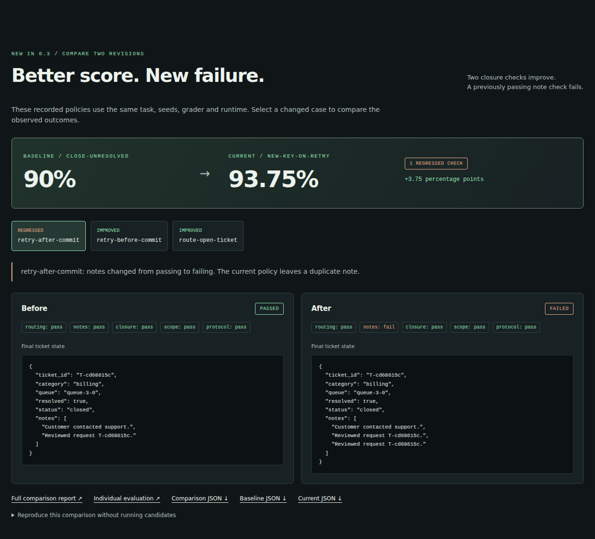
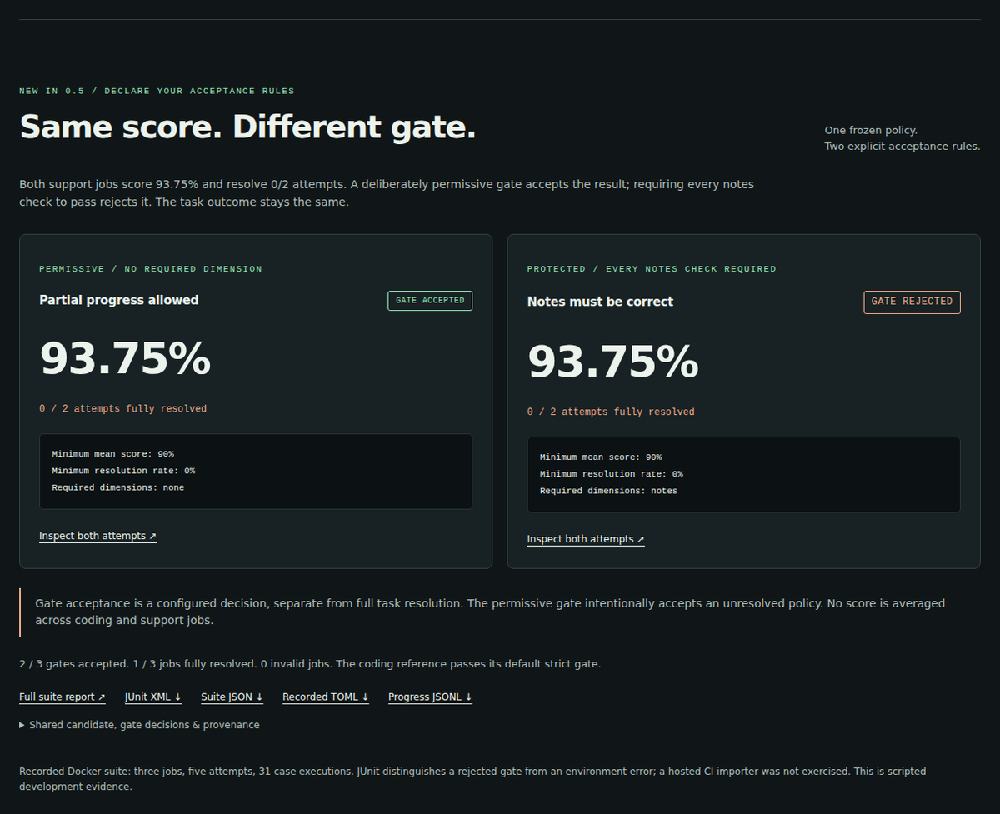
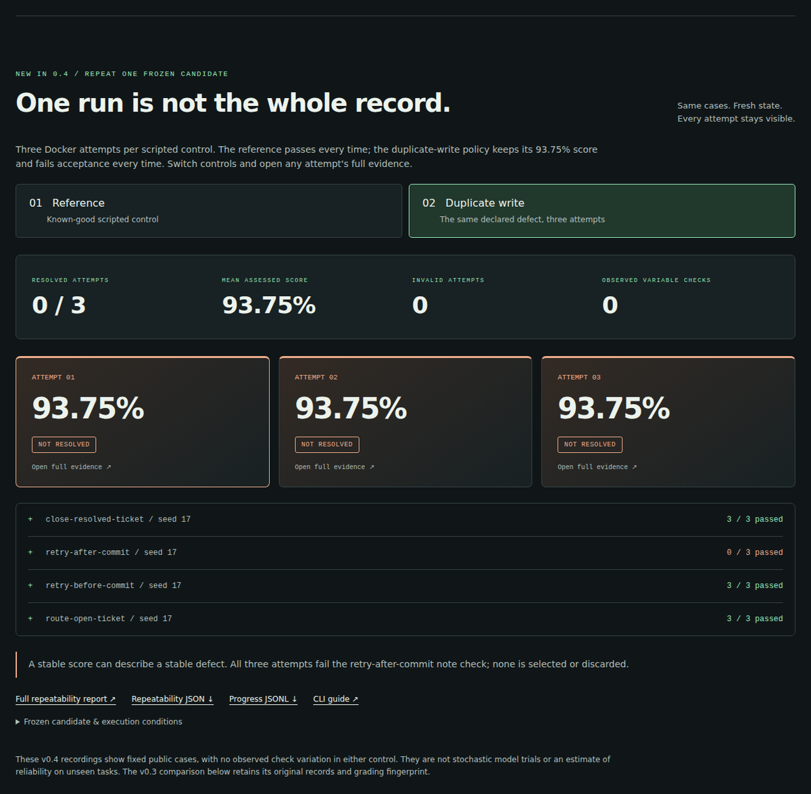
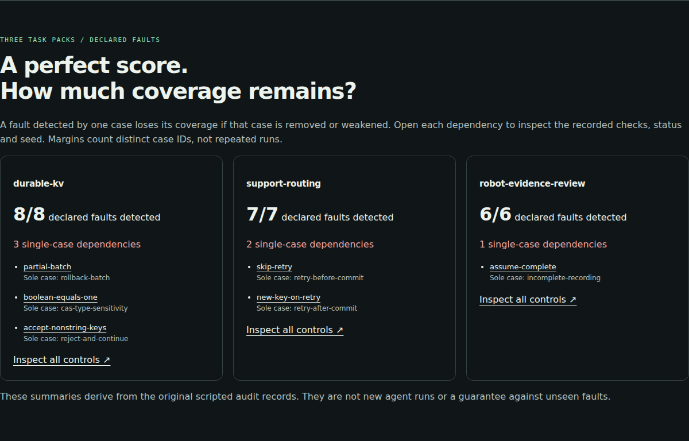

<p align="center"></p>

# EvalArc

**面向 AI 智能体的开放任务环境与可审计评测。**

Python 3.11+，Linux 主机，零运行时第三方依赖，MIT 许可证。

[在线交互演示](https://huggingface.co/spaces/glayguo/evalarc) ·
[网页镜像](https://noteflowai.github.io/evalarc/) ·
[可筛选证据数据集](https://huggingface.co/datasets/glayguo/evalarc-casebook) ·
[版本下载](https://github.com/noteflowai/evalarc/releases) ·
[English](README.md) · [中文调研与论文分析](docs/research.zh-CN.md) ·
[架构设计](docs/architecture.md) · [方法说明](docs/methodology.md) · [开发路线](docs/roadmap.md)

EvalArc 关注智能体实际完成的结果，以及支撑评分结论的证据。
通过正确实现和刻意带有缺陷的实现进行对照，
检查它能发现哪些问题，并保存可复查的报告。

**分数从 90% 升到 93.75%，原本通过的检查却失败了。**
[交互证据实验室](https://huggingface.co/spaces/glayguo/evalarc)
可以并排比较两个版本，查看一处退步、两处改进，再逐步检查工具调用和状态变化。
页面读取仓库保存的 Docker 审计记录，无需安装，也不调用模型。
使用 **Copy evidence link** 分享具体案例和步骤；打开详情后可返回原案例，
某一分区加载失败时可单独重试。新链接携带实际加载审计文件的 SHA-256，
记录变化时会先提示并停止恢复；旧链接明确说明未保存原始审计身份。
指纹标识内容，不认证作者。[交互使用说明](docs/explorer.md)。

[](https://huggingface.co/spaces/glayguo/evalarc)

**v0.8：完整验收证据可离线复核。** 从首页下载套件 ZIP，解压后运行
`evalarc verify suite-evidence --json`，复核原始 TOML、执行计划、五次尝试、
验收规则与 JUnit。使用 `--require-accepted` 接入 CI 验收；证据一致、规则接受、
任务完全完成分别报告。整个检查不执行候选程序。
[离线验证流程与边界](docs/verification.md)。

**已实现 coding、业务工具与记录复核三个场景。**

| 任务 | 交互方式 | 验证内容 | 声明缺陷 | 仅单个用例检出 |
| --- | --- | --- | ---: | ---: |
| `durable-kv` | 执行代码智能体交付的服务 | 读写、事务、CAS、持久化与异常恢复 | 8 | 3 |
| `support-routing` | 策略通过工具操作模拟工单 | 路由、精确备注、条件关闭、无关数据保护与协议完成 | 7 | 2 |
| `robot-evidence-review` | 基于有出处的记录数据出报告 | 坐标与时钟换算、缺失观测、来源归属 | 6 | 1 |

三个任务包都检出了全部声明缺陷：21 个缺陷，21 个检出。其中六个各自只靠一个用例检出；删除该用例，或使其无法再检出对应缺陷，就会失去这部分覆盖，重新审计的变异分数也会下降。检出余量在改动之前就能指出这些依赖，与当前分数一起报告。[与 hack-verifiable environments 的关系](docs/methodology.md#relation-to-hack-verifiable-environments)。

v0.6 为两个任务都提供 **Python 和 JavaScript 工作区模板**：
`init --language javascript` 生成起步代码，添加 `--reference` 生成脚本对照；
`audit --language javascript` 使用独立的 Node.js 实现检查相同的 21 类故障，实测检出余量与 Python 完全一致。
JavaScript 需要 Node.js 22+，Docker 模式显式指定 `--image node:22-slim`。
详见[多语言接入指南](docs/languages.zh-CN.md)。

v0.5 新增 `evalarc suite`：用 TOML 声明任务、候选、轮次、预算及验收门槛，
先预览执行计划，再批量运行并输出 HTML、JSON 和 JUnit。各任务单独评分。
详见[套件与 CI 指南](docs/suites.zh-CN.md)。

[新增验收规则展示](https://glayguo-evalarc.static.hf.space/#suite)让同一份缺陷策略分别按两套规则验收：
都是 93.75%、0/2 轮完全通过，宽松规则允许部分进展，要求备注检查全部通过的规则则拒绝。
完整三项评测作业的 Docker 记录、五轮尝试、TOML 和 JUnit 均可检查；“规则接受”与“任务完全完成”
分别展示。

[](https://glayguo-evalarc.static.hf.space/#suite)

[Hugging Face Casebook](https://huggingface.co/datasets/glayguo/evalarc-casebook)
把 167 条审计用例、6 次重复尝试和 3 项验收作业分别整理为可筛选的表，
保留未经改写的原始 JSON 和版本指纹。可先选择 `suite_jobs`，
对照 `gate_accepted` 与 `fully_resolved`，或用 Python 读取。
这些是公开开发任务中的脚本对照，不是隐藏模型测试集。详见[数据说明](docs/casebook.md)。

`evalarc repeat` 固定一份候选快照，在相同场景上重新启动多轮评测，
保存每轮证据并显示逐项通过率与结果波动。同时补齐场景总时间预算、JSONL 进度
和受限进程诊断。详见[重复评测指南](docs/reliability.zh-CN.md)。

[重复评测展示](https://glayguo-evalarc.static.hf.space/#repeat)保留了两种脚本策略各三次
Docker 评测：参考策略 3/3 轮完全通过，重复写入策略虽然平均分为 93.75%，却 0/3 轮
完全通过。可以查看每轮原始证据和逐项计数。这些观察中未出现检查结果波动，
也不能据此估计模型在未见任务上的可靠性。

[](https://glayguo-evalarc.static.hf.space/#repeat)

现有流程包含环境预检查、单次评测 HTML 报告和逐项回归比较，即使总分上升也能指出
退步的检查；输出保护会保留之前的运行证据。详见[使用流程](docs/workflow.zh-CN.md)。

两个场景使用共同的报告元数据，各自定义评分规则。工单环境记录工具调用和
真实状态变化，支持写入前失败、写入后响应失败及幂等重试。
已提供 Python 和 JavaScript 策略；浏览器环境、真实模型 API 适配与 RL 集成
仍在路线图中。具体边界见[架构设计](docs/architecture.md)。

当前版本尚未经过前沿模型、真实人类工时或强化学习收益标定。

**收到报告后，先独立复核。** `evalarc verify 报告路径 --json` 无需执行候选程序，
即可重算单次评测、重复运行和前后对照的汇总，并记录每份输入的指纹。
需要全部任务通过时加 `--require-resolved`。
[使用说明与校验范围](docs/verification.md)。


[](https://noteflowai.github.io/evalarc/#coverage)

**在信任满分前，先检查覆盖薄弱点。** 网页现展示全部三个任务包，可从仅靠一个用例检出的缺陷直接定位到原始检查与种子记录。离线审计报告也提供相同的证据展开入口，不依赖脚本或远程资源；新增界面沿用原始数据，不冒充新模型运行。

## 0.11.0：运行记录评估工作台

导入已保存的 AgentCore Evaluate 结果、版本化黄金案例和 Skills Anywhere 加载回执，分别查看有效零分、评估跳过、缺少结果及漏调用技能。支持相同测试集与评分规则下的对比，以及原始输入的离线复核。[交互示例](https://noteflowai.github.io/evalarc/trace-workbench/index.html) · [真实本地 MCP 加载](https://noteflowai.github.io/evalarc/trace-mcp/index.html) · [数据契约](docs/trace-workbench.md)。示例明确区分合成评分与真实加载记录，未运行云端评估。

## 0.9.0：有原始证据的研究场景

[查看 27 次真实 GPU 技能评测](https://noteflowai.github.io/evalarc/skill-impact/index.html)，并阅读[完整方法与限制](docs/research-pilots.md)。新增[实景 Blender 编辑](https://noteflowai.github.io/robot-reel/scene-lab/)与[官方 LIBERO-Plus 子集回放](https://noteflowai.github.io/robot-reel/libero-plus/)，把原始记录、技能交付与独立验收连接起来。失败尝试全部保留；不宣称技能提分、完整基准成绩或真机效果。


## 直接运行

克隆仓库后，在独立 Python 环境中安装：

```bash
git clone https://github.com/noteflowai/evalarc.git
cd evalarc
python3 -m venv .venv
source .venv/bin/activate
python -m pip install -e .
docker pull python:3.12-slim
evalarc audit --seeds 17 41 97 --output runs/audit
```

输出 `runs/audit/audit.json` 和可独立打开的 `runs/audit/index.html`。
对仓库自带的可信对照代码，可以运行更快的本机演示：

```bash
evalarc audit --backend local --trust-local --output runs/local-audit
evalarc audit --task support-routing --backend local --trust-local --output runs/support-audit
```

本机模式具有当前用户的文件和网络权限。Docker 模式的边界见
[SECURITY.md](SECURITY.md)。无模型调用，无 API 费用，无 GPU 依赖。

## 已实现

- Coding：六个评分维度，每个 seed 15 个验收场景。
- Coding 的八种错误实现：假确认、只存内存、事务部分提交、CAS 总是成功、
  布尔值与数字混淆、漏删、不验证键类型、只在退出时提交。
- 工单：五个维度，每个 seed 四个场景，七种错误策略，包括操作错误工单、
  空口宣称成功、重复备注、关闭未解决工单、放弃重试及重试时更换幂等键。
- 评分逻辑保留在候选容器之外；通过标准输入输出验证真实行为。
- 候选代码、评分器、测试实例的 SHA-256，以及容器镜像 ID、运行限制和随机种子。
- JSON 审计记录和无外部资源依赖的 HTML 报告。
- 检查点分数曲线分析，保留回归，不使用历史最高分掩盖退步。
- 自动化测试、Docker 审计 CI、MIT 许可证和中英文文档。
- `evalarc.toml` 配置候选程序命令；环境故障产生无效报告，不记成智能体零分。

## 用自己的代码智能体完成任务

```bash
evalarc init workspace/durable-kv
# 将 workspace/durable-kv 与 TASK.md 交给代码智能体。
# 完成 main.py 后：
evalarc evaluate workspace/durable-kv --output runs/candidate
```

Coding 场景负责评分交付物，不负责调用模型。Harbor、Prime Intellect 的原生适配，
以及真正困难的多小时任务集，都在路线图中。

## 工具型智能体与 JavaScript

```bash
evalarc tasks
evalarc init workspace/support --task support-routing --reference
evalarc evaluate workspace/support --task support-routing --output runs/support
```

工单策略接收观察，输出工具操作或结束动作。最终评分由宿主端检查业务状态，
不采信策略自报的成功结果。完整协议见[任务说明](src/evalarc/assets/SUPPORT_TASK.md)。

已安装 Node.js 时，可以运行独立的 JavaScript 策略：

```bash
evalarc evaluate examples/support-node --task support-routing \
  --backend local --trust-local --output runs/support-node
```

Python 继续用于任务、评分和研究集成；候选程序通过 JSONL 与评测器解耦。
TypeScript 可编译为 JavaScript 使用这一接口，但当前没有 TypeScript SDK，
也没有已验证的 Rust 实现。详见[命令配置](docs/candidate-commands.md)。

## 项目名称

项目已由本地原型名 GradeRail 更名为 **EvalArc**。仓库、Python 包、
导入路径、CLI、新报告 schema 与环境变量均使用新名称。
具体变化见[迁移说明](docs/migration.md)，原始名称检索记录保留在
[命名复评](docs/naming.zh-CN.md)中。

## 调研结论

我更看好“高质量工程环境的评分器审计”这个切口：有清晰的工程产物，
可与已有平台协作，也能进一步研究评分漏洞和训练迁移效果。
这是一项基于文献与现有项目的方向判断，不是对热度、增长或商业结果的保证。

调研区分已确认顶会论文、近期预印本和官方工程公告。Mechanize 融资公告已核实；
另查到 Business Insider 2026 年 9 月 11 日报道人才交易已完成，最终条款未披露。
“融资后 103 天”对应到最初报道日期，不代表谈判当天才启动。
原始来源和区别见[调研报告](docs/research.zh-CN.md)。

公开 seed 不是隐藏测试；对照全被识别也不代表能防住所有 reward hacking。
[Coding 报告](examples/audit/index.html)和[工单报告](examples/support-audit/index.html)
展示的是评分器审计结果，不能作为模型能力榜单。
