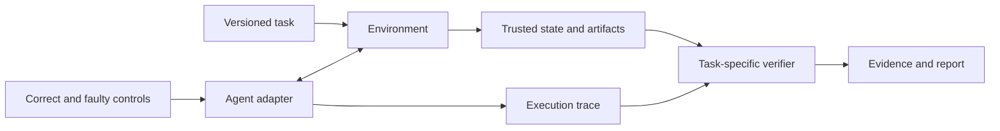

# Architecture and domain expansion

EvalArc's direction is open environments and auditable evaluations for
software agents. This document distinguishes the working v0.1 implementation
from interfaces proposed for subsequent releases.

## Current implementation

The CLI snapshots a completed candidate workspace and evaluates its `main.py`
against the Durable KV contract. A host-side oracle checks JSONL responses.
Candidate sessions share database state only within the same case. The audit
runs the same checks against one reference and eight declared faulty variants.
Reports carry task and runtime settings, source fingerprints, and case evidence.

This is artifact evaluation. The current CLI does not invoke a model, expose a
browser, or drive a tool-calling agent loop. The Python entrypoint and task
implementation remain specific to the first pack.

## Proposed shared interfaces

| Interface | Responsibility | Domain-specific examples |
| --- | --- | --- |
| Task | Goal, initial state, allowed actions, constraints, budget, version | Implement a service; route a support ticket; update an order |
| Environment | Reset, observe, execute actions, expose trusted state | Container; simulated business API; browser with a test backend |
| AgentAdapter | Convert observations/actions for a chosen agent workflow | External code submission; scripted policy; model tool calls |
| Verifier | Check outcomes and constraints, produce evidence-backed results | Executable tests; database assertions; calibrated human/model rubric |
| Evidence | Record events, artifacts, grader decisions, provenance and usage | Requests/responses; state changes; screenshots; cited passages |

These names describe a design proposal, not importable APIs in v0.1.

Environment and verifier ownership must remain separate from an agent's
self-reported outcome. Domains share evidence metadata; each retains its own
scoring semantics. A browser action and a database update are not interchangeable
just because both can be serialized to JSON.

## Next milestone: a support-ticket simulation

After introducing task definitions and configurable candidate commands, add a
small simulated service with operations such as looking up a ticket, assigning
its queue, adding a note, and closing it. The task supplies the customer request
and routing rules; the agent must perform the appropriate service operations.

Acceptance evidence should include:

1. Final ticket state is checked outside the agent process.
2. The trace distinguishes attempted calls, successful calls, and state changes.
3. A correct scripted policy passes without a model API.
4. Policies that update the wrong ticket, claim success without an update, or
   repeat a non-idempotent action are rejected by the intended checks.
5. Tool or environment failures are reported separately from agent task failure.
6. Both the coding and workflow packs emit the same common report metadata
   without sharing a task-specific scalar score definition.

Only after both domains work should the shared interface be treated as stable.
A browser adapter can follow using the same evidence contract with its own
reset and state-verification logic.

## Language boundaries

Keep task generation, scoring, and research integration in Python. Make the
candidate command and environment declarative so submissions can use other
languages. Add TypeScript when an interactive viewer or JavaScript SDK is
implemented. Introduce a Rust worker only after measured execution or
distribution requirements justify a separate component.

The existing `main.py` restriction remains until the task/command interface is
implemented. This release does not claim TypeScript or Rust candidate support.

## Metrics

Report task completion, constraint violations, resource usage, and repeated-run
reliability with clear definitions for each domain. Separate measured values,
caller-reported values, and missing values. Model-scored judgments should record
the judge, rubric, calibration process, and uncertainty when available.

Cross-domain comparisons need an explicit task distribution and aggregation
method. Neither current code fingerprints nor a shared JSON report schema make
different domains' scores directly comparable.
