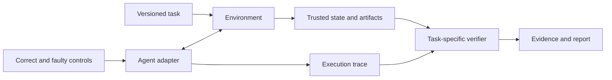

# Architecture and domain expansion

EvalArc's direction is open environments and auditable evaluations for
software agents. This document distinguishes the working v0.6 implementation
from interfaces proposed for subsequent releases.

## Current implementation

The CLI selects a built-in `TaskDefinition`, snapshots the candidate workspace,
and reads its optional `evalarc.toml` command. Each task defines generation,
execution, dimensions, source fingerprints, and candidate assets.

Durable KV evaluates a completed service with a host-side oracle; sessions share
database state only within the same case. Support routing drives a candidate
policy through a JSONL loop. Its in-memory ticket service and independent final
state verifier live in the host process, outside the candidate container.

Both packs emit `evalarc.evaluation.v2` reports through the same aggregator and
use `evalarc.audit.v2` for declared controls. Metadata includes domain, task
version, command, fingerprints, runtime limits, outcomes, and validity. Checks
and evidence remain domain-specific.

The current CLI does not invoke a model or expose a browser. The tool policy is
an external program; Python and JavaScript examples are scripted controls.

`repeat` executes fresh attempts from a frozen candidate and summarizes
case/check variability. `suite` coordinates repetitions across declared jobs:
it freezes all candidate inputs before execution and applies per-job acceptance
rules after scoring. Suite gates never change task verification or mix task
scores into a common scalar. JUnit represents the gates, while complete task
evidence stays in each job's reports. See the [suite guide](suites.md).

## Interface responsibilities

| Interface | Responsibility | Domain-specific examples |
| --- | --- | --- |
| TaskDefinition | Pack version, cases, execution, dimensions, assets | Durable KV; support routing |
| Environment | Reset, execute actions, expose trusted state | Process runtime; host ticket service |
| Agent adapter | Convert observations/actions for an agent workflow | Current JSONL process; future model-provider adapters |
| Verifier | Check outcomes and constraints | Coding oracle; independent ticket-state checks |
| Evidence | Record decisions, provenance, and usage | Response hashes; tool results and state changes; unknown model usage |

`TaskDefinition` is an internal dataclass. The other rows describe responsibilities,
not generic public classes or a stable SDK. See the [task-author guide](task-authoring.md).

Environment and verifier ownership must remain separate from an agent's
self-reported outcome. Domains share evidence metadata; each retains its own
scoring semantics. A browser action and a database update are not interchangeable
just because both can be serialized to JSON.

## Implemented support-ticket simulation

A small simulated service exposes ticket lookup, queue assignment, idempotent
note addition, and closure. Four case families test ordinary routing, resolved
ticket closure, a transient failure before assignment, and a transient failure
after a note commits. The agent has at most 12 action responses including finish.

The implementation provides:

1. Final ticket state is checked outside the agent process.
2. The trace distinguishes attempted calls, successful calls, and state changes.
3. A correct scripted policy passes without a model API.
4. Seven declared faulty policies, including wrong-ticket updates, false success,
   repeated notes, and retries with a new idempotency key.
5. Tool errors and state changes in the trace. Explicit environment failures
   invalidate a run and leave its aggregate score unassessed.
6. Both the coding and workflow packs emit the same common report metadata
   without sharing a task-specific scalar score definition.

The interface remains experimental. Next steps are independent task authoring
and an actual agent-provider adapter, followed by a browser environment with its
own reset and state-verification logic. Scripted policies do not establish LLM
performance, task difficulty, or generalization.

## Language boundaries

Task generation, scoring, and research integration remain in Python. Candidate
commands are declarative so submissions can use other languages. Add TypeScript
when an interactive viewer or JavaScript SDK is
implemented. Introduce a Rust worker only after measured execution or
distribution requirements justify a separate component.

The `main.py` restriction applies only to the default command. Both task packs
now have Python and JavaScript starters, references, and declared fault audits.
Templates live outside grading source files. Node's durable reference uses
JSON snapshots, independently of the Python SQLite reference; it preserves
numeric source text and type-sensitive equality through process restarts.
The runtime still executes the manifest command without a language-specific
worker or bridge. See the [multilanguage guide](languages.md) and
[candidate commands](candidate-commands.md) for image and executable requirements.
This release has no TypeScript SDK or tested Rust submission/worker.

## Metrics

Report task completion, constraint violations, resource usage, and repeated-run
reliability with clear definitions for each domain. Separate measured values,
caller-reported values, and missing values. Model-scored judgments should record
the judge, rubric, calibration process, and uncertainty when available.

Cross-domain comparisons need an explicit task distribution and aggregation
method. Neither current code fingerprints nor a shared JSON report schema make
different domains' scores directly comparable.
