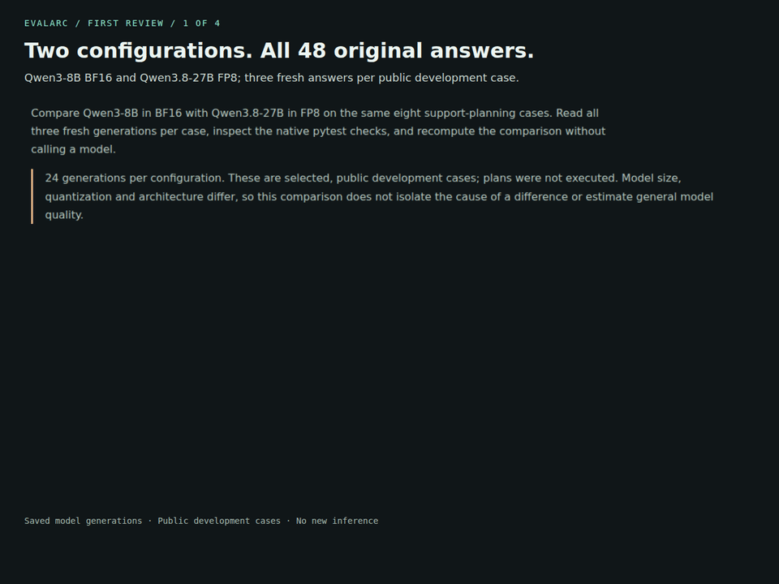

# Your first model-upgrade review

Install the published reviewer, download the immutable recorded example, and
reproduce its upgrade decision. No repository checkout, GPU or model API is needed.

[Open the comparison](https://noteflowai.github.io/evalarc/model-upgrade/index.html) ·
[30-second walkthrough](assets/ai-first-review.mp4)



## 1. Install the released reviewer

Use Python 3.11+ and a new directory. These commands use Bash on Linux/macOS.

```sh
mkdir evalarc-model-first-review && cd evalarc-model-first-review
python3 -m venv .venv
.venv/bin/python -m pip install evalarc==0.15.0
```

## 2. Download and check the recorded example

This downloads the `v0.15.0` release ZIP, checks its SHA-256 before extraction,
and keeps the original file. The hash is also in the release's `SHA256SUMS`.

```sh
.venv/bin/python - <<'PY'
import hashlib
import io
from pathlib import Path
from urllib.request import urlopen
from zipfile import ZipFile

url = "https://github.com/noteflowai/evalarc/releases/download/v0.15.0/evalarc-model-upgrade.zip"
expected = "6b1b9212d5b25da281c54f192489298af7a0b0f4524f807ea6e2821bfa6f515c"
with urlopen(url, timeout=60) as response:
    data = response.read()
if hashlib.sha256(data).hexdigest() != expected:
    raise SystemExit("Archive checksum differs; do not extract it.")
Path("recorded-review").mkdir()
with Path("review.zip").open("xb") as output:
    output.write(data)
with ZipFile(io.BytesIO(data)) as archive:
    archive.extractall("recorded-review")
PY
```

Open `recorded-review/index.html` to browse all 48 original answers offline.
The complete plan matches in **15/24 baseline answers and 19/24 current answers**.
The cases are selected public development examples; plans were not executed.
Model size, architecture and quantization differ.

## 3. Reproduce the upgrade decision

```sh
.venv/bin/evalarc diff recorded-review/reports/baseline.xml \
  recorded-review/reports/current.xml --output my-review
```

**Expected exit: 1.** The command completed and rejected the upgrade: five named
checks regressed and five became less reliable. Open `my-review/index.html` or
read `my-review/diff.json`. Ten other checks improved and twenty were unchanged.
The ten blocking checks share two format/schema failures; they are not ten
independent causes.

Select `already-closed`, seed `17`, in the recorded browser review. The baseline
returns `{"actions":[]}`; the current model returns `{}` and omits the required
key. A higher complete-plan total does not erase that regression.

This command compares preserved native test results. It does not regenerate
answers or independently rerun their checks.

## 4. Optionally recheck the original answers

To execute the declared checks again, install the recorded pytest version:

```sh
.venv/bin/python -m pip install pytest==8.4.2
.venv/bin/python recorded-review/regrade.py --output regraded
```

This runs the five declared checks against every preserved answer, writes fresh
JUnit files and recomputes the comparison. The **regrade script exits 0 when its
work finishes**, while `regraded/comparison.json` still has `"gate_passed": false`.
No model is called. Use a new output directory each time.

Five checks are applied to each of 24 answers per configuration, producing 120
check outcomes for each side. Invalid JSON can fail several checks together.
The grader redacts only hostnames and absolute report-directory metadata and
records before/after hashes; the model answers remain unchanged.

## Bring your own change

Keep case IDs, check names and the evaluated contract aligned across the two
runs, retain every attempt, and pass the native results to `evalarc diff`.
See [the input formats and gate rules](../examples/results-diff/README.md).
This example's protocol, model identities and reproduction details are in
[the experiment guide](../examples/model-upgrade/README.md).

## Walkthrough transcript

The 30-second video has four annotated screenshots of actual recorded UI states:
the two configurations, the higher total with a blocked gate, the missing
`actions` key and the native check diff. It has no audio or new inference.
[Captions](assets/ai-first-review.vtt) and
[source/file hashes](assets/ai-first-review-media.json) accompany it.
Rebuild with `scripts/capture_ai_walkthrough.cjs` after building the site.

## 中文快速开始

这条路径从已发布的 `evalarc==0.15.0` 和固定版本的 ZIP 开始，无需克隆仓库、GPU
或模型密钥。下载脚本先核对 SHA-256，再解压。

`evalarc diff` 的预期退出码是 **1**：比较已经完成，但升级门禁拒绝通过。
总匹配数从 15/24 提高到 19/24，仍存在 5 个检查回归和 5 个可靠性下降。
这些阻断检查对应两个用例的格式或结构问题。

默认步骤只比较已保存的 JUnit 结果。可选的 `regrade.py` 会重新执行原始回答的
检查；脚本完成时退出 **0**，报告中的模型升级门禁仍为失败。所有回答均完整保留。
